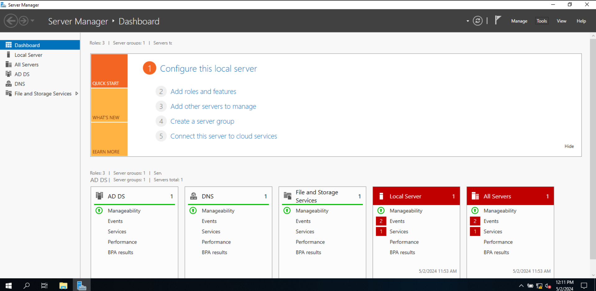
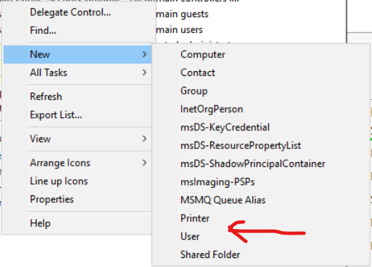
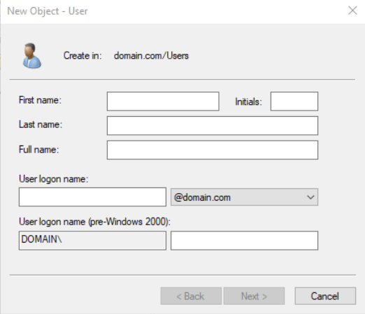
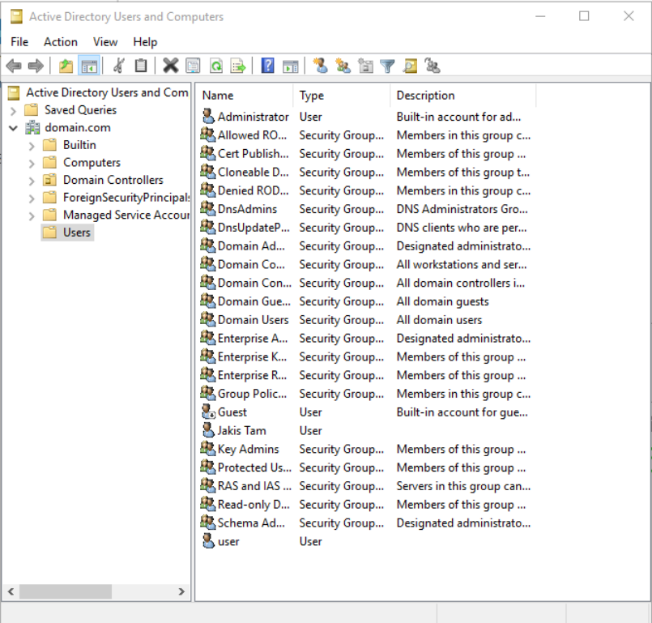
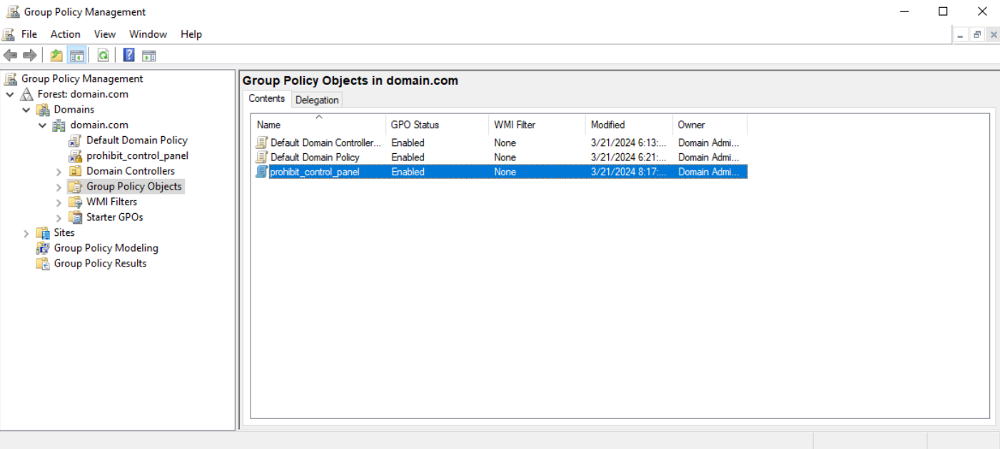
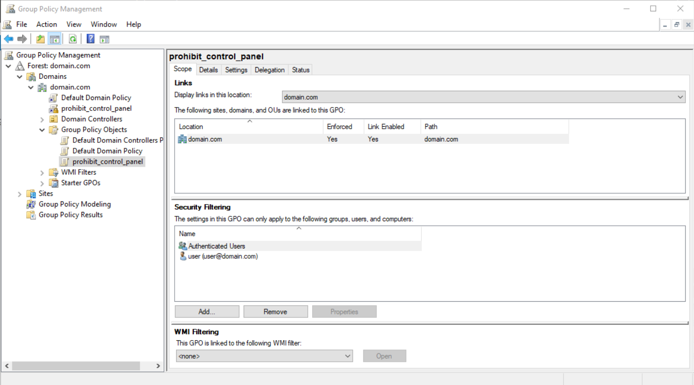
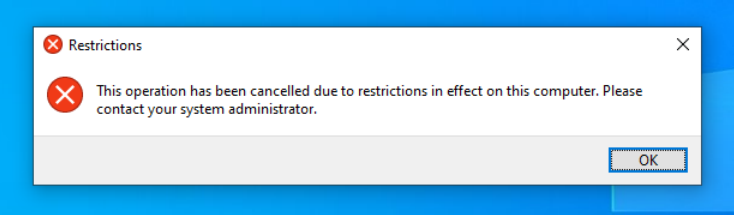

# Windows Server Configuration with Active Directory

useful links:
[link1](https://www.youtube.com/watch?v=Ok3HZm0aq5E)
[link2](https://www.youtube.com/watch?v=04pAiANkr_s)
[link3](https://www.youtube.com/watch?v=l9XtK4Shps8)
[link4](https://www.youtube.com/watch?v=NHbwlQHidtU)
[link5](https://www.youtube.com/watch?v=5M_zJaeNQTw)
[link6](https://www.youtube.com/watch?v=FyV3UNIJsZk)

This guide provides instructions on how to install Windows Server with Active Directory, configure a user, and enforce certain policies.

1. **Install Windows Server**: Download and install Windows Server on a new virtual machine in VirtualBox.

2. **Set Up Domain**: Once Windows Server is installed, set up a new domain using Active Directory Domain Services.

3. **Create a User**: In the Active Directory Users and Computers console, create a new user. Fill in the necessary details such as the user's name, logon name, and password, and force password change at next logon.

4. **Create Policy and Add the User to the Policy**: Create a new Group Policy Object (GPO) in the Group Policy Management console. Configure the GPO to block access to the Control Panel, add user to the policy.

5. **Install Windows Client**: Install a Windows client operating system (like Windows 10) on another virtual machine in VirtualBox.

6. **Connect to the Domain through Settings**: On the client computer, open System Properties and change the computer from Workgroup to Domain. Enter the domain name you created earlier and provide the necessary credentials when prompted.

7. **Change the Password**: At the first logon, the user will be prompted to change their password due to the policy enforced earlier. The user should follow the prompts to change their password.

8. **Check if the Control Panel is Available**: After the password change, the user should attempt to access the Control Panel. If the policy was configured correctly, access to the Control Panel should be blocked.

