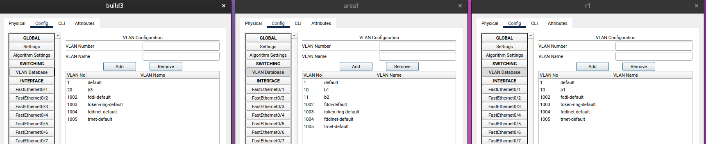
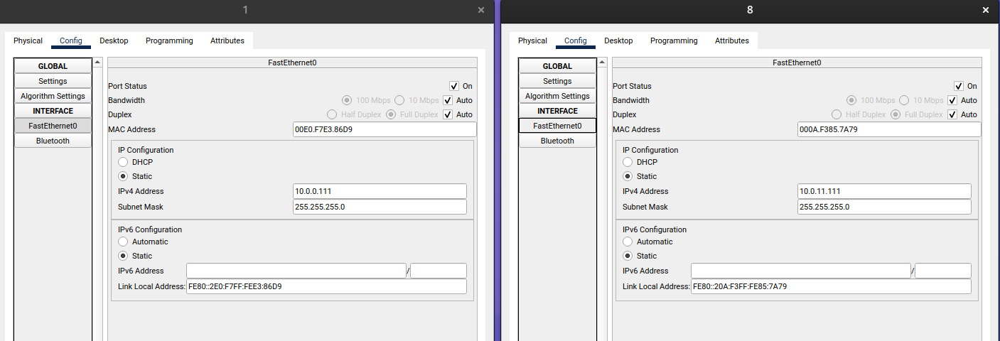
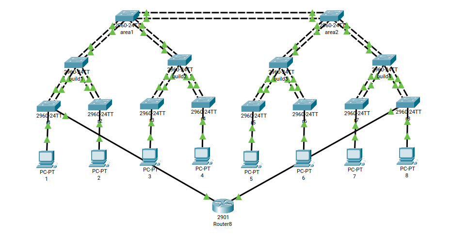

# Network Switches Infrastructure in Cisco Packet Tracer

This guide provides instructions on how to design an infrastructure consisting of network switches in Cisco Packet Tracer.

## Switch Configuration

1. **Name the Switch**: Use the GUI
2. **Set Management IP Address**: Use the command `Switch(config)# interface vlan [number]` followed by `Switch(config-if)# ip address [IP Address] [Subnet Mask]` to set the IP address.
3. **Set Enable Password**: Use the command `Switch(config)# enable secret [Password]` to set the password.
4. **Set Console Password**: Use the set of commands `Switch(config)# line console 0`; `Switch(config-line)# password [Password]`; `Switch(config-line)# login` to set console password

## VLAN Configuration

5. **Create VLAN**: use the GUI

## Trunk Configuration

6. **Configure Trunk**: Use the command `Switch(config)# interface [Interface ID]` followed by `Switch(config-if)# switchport mode trunk` to configure a trunk.

## Redundant Link Configuration

7. **Configure Redundant Link**: Add the interfaces to the logic group and activate it: `Switch(config)# interface range [Interface ID range]` and `Switch(config-if-range)#channel-group [Group Number] mode active`

## Computer Connection

8. **Connect Computers**: Connect computers to the access ports of each VLAN in the GUI.

## Interface Description

9. **Set Interface Description**: Use the command `Switch(config)# interface [Interface ID]` followed by `Switch(config-if)# description [Description]` to set the interface description.

## RSTP+ Configuration

10. **Configure RSTP+**: Use the command `Switch(config)# spanning-tree mode rapid-pvst` to configure the RSTP+ protocol for loop protection.

