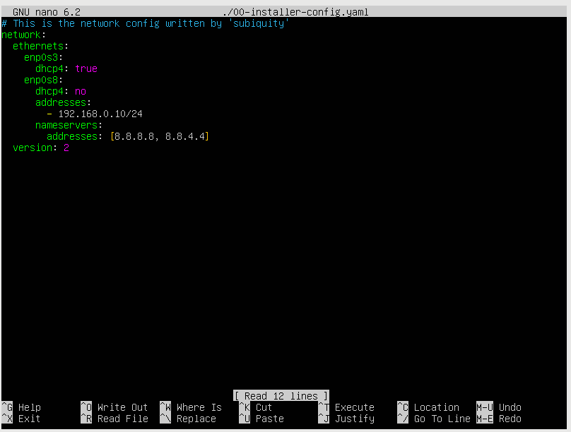
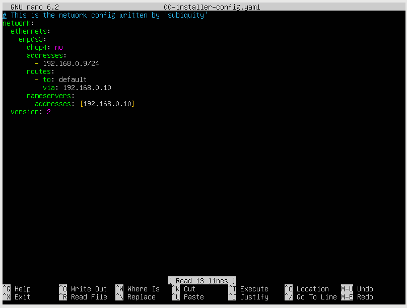

# VirtualBox Configuration for Ubuntu Servers

This guide provides instructions on how to configure two Ubuntu servers in VirtualBox. The first server acts as a client, while the second server provides internet access to the first and acts as a firewall, only passing traffic on ports 80, 443, and 22.

## Setup

1. **Install VirtualBox**: Download and install VirtualBox from this link.
[VB download link](https://www.virtualbox.org/wiki/Downloads)
2. **Create Ubuntu Servers**: Create two virtual machines in VirtualBox, both running Ubuntu Server.

## Network Configuration

3. **Create an Internal Network**: Set up an internal network between the two servers in VirtualBox. Ensure that one of them (the firewall) has access to the internet.
4. **Configure the Server Network**:
   - **Set up IP Address**: Configure the IP address on the server using Netplan.
   - **Set up Nameservers**: Configure the nameserver IPs on the server using Netplan.

5. **Configure the Client Network**:
   - **Set up IP Address**: Configure the IP address on the client using Netplan.
   - **Set up Routes and Nameservers**: Configure the routes and nameservers on the client to point to the server IP using Netplan.

## Firewall Configuration

6. **Install UFW**: Install UFW (Uncomplicated Firewall) on the server.
7. **Enable IP Forwarding**: Configure the server to forward packets from the client to the internet.
8. **Set Firewall Rules**: Configure the firewall to only pass traffic on ports 80, 443, and 22.

## Commands and Descriptions

- Enable IP Forwarding on VM2:
  - sudo nano /etc/sysctl.conf
  - write `net.ipv4.ip_forward=1`
  - sudo sysctl -p
- Set Up NAT on VM2:
  - sudo iptables -t nat -A POSTROUTING -o enp0s3 -j MASQUERADE
  - sudo iptables -A FORWARD -i enp0s3 -o enp0s8 -m state --state RELATED,ESTABLISHED -j ACCEPT
  - sudo iptables -A FORWARD -i enp0s8 -o enp0s3 -j ACCEPT
- Configure VM1 to use VM2 as its default gateway:
  - sudo nano /etc/network/interfaces
  - gateway `some_ip`
  - sudo service networking restart
- Saving iptables rules:
  - sudo netfilter-persistent save
  - (install if don't have) sudo apt install iptables-persistent
- UFW setup:
  - sudo apt install ufw
  - sudo ufw default deny incoming
  - sudo ufw default deny outgoing
  - sudo ufw allow `some_port`
  - sudo ufw enable
